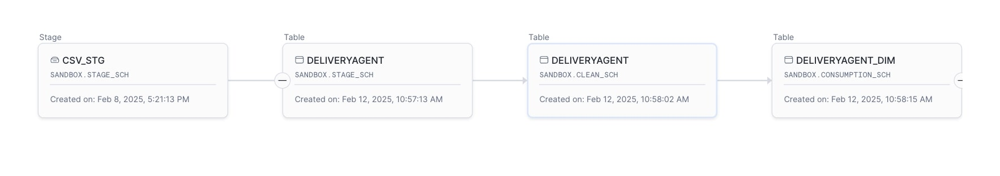

# Swiggy Data Warehouse Implementation

This project implements a comprehensive data warehouse solution for Swiggy's food delivery platform using Snowflake. The implementation follows a multi-layered architecture designed to transform operational data into an analytics-ready format that supports business intelligence, reporting, and data science initiatives.
The data warehouse integrates data from multiple source systems into a cohesive dimensional model, enabling cross-functional analysis of customer behavior, restaurant performance, delivery operations, and revenue metrics. By implementing slowly changing dimensions (SCD Type 2) for key entities, the system preserves historical accuracy while maintaining current views of the business.
The solution includes:

- A three-tiered data architecture (Stage, Clean, Consumption layers)
- Automated data transformation processes
- Dimensional modeling with fact and dimension tables
- Pre-built KPI views for common business metrics
- An interactive Streamlit dashboard for business users
- The fundamental purpose behind creating this project is to showcase to our business team how we can design a modern data warehouse with effective data modeling. For this implementation, I've chosen Snowflake as the primary platform.

## Why Snowflake?

- For this implementation, Snowflake was selected over alternatives like AWS Redshift or GCP BigQuery for several key reasons:

- **Separation of storage and compute**: Allowing for independent scaling of resources
- **Zero-management infrastructure**: Reducing operational overhead
- **Pay-per-use model**: Optimizing cost efficiency
- **Seamless scalability**: Supporting business growth without infrastructure constraints
- **Multi-cluster architecture**: Enabling concurrent workloads without performance degradation
- **Native support for semi-structured data**: Simplifying the integration of various data formats
## Table of Contents

- [System Architecture](#system-architecture)
- [Data Warehouse and Data Modeling](#data-warehouse-and-data-modeling)
- [OLTP vs OLAP](#oltp-vs-olap)
- [Entities](#entities)
  - [Restaurant](#restaurant)
  - [Location](#location)
  - [Menu](#menu)
  - [Customer](#customer)
  - [Address](#address)
  - [Order](#order)
  - [Order Item](#order-item)
  - [Delivery Agent](#delivery-agent)
  - [Delivery](#delivery)
  - [Login Audit](#login-audit)
- [KPI Views](#kpi-views)
- [Streamlit Dashboard](#streamlit-dashboard)

## System Architecture

This implementation follows a standard batch processing pattern where data flows from source systems through a multi-layered architecture in Snowflake:

1. **Stage Layer**: Raw data landing from source systems
2. **Clean Layer**: Data with appropriate types and business rules applied
3. **Consumption Layer**: Dimensional model with SCD Type 2 implementation for historical tracking

For this project, files were manually loaded into Snowflake. However, in a production-grade implementation, an Apache Airflow pipeline would orchestrate the entire process:

The production data pipeline would consist of these key stages:
1. **Data Extraction**: Loading data from source systems to Snowflake Stage locations
2. **Stage to Clean Transformation**: Applying data type conversions and validations
3. **Clean to Consumption Transformation**: Implementing dimensional modeling with SCD Type 2
4. **KPI Generation**: Creating analytical views for business consumption
5. **Monitoring & Alerting**: Ensuring data quality and pipeline health

Each entity would have its own DAG (Directed Acyclic Graph) in Airflow, with appropriate dependencies to ensure data consistency.

## Data Warehouse and Data Modeling

A data warehouse is a centralized repository designed for analytical processing and business intelligence. For this Swiggy implementation, we've employed a star schema dimensional model in the consumption layer:

- **Fact Tables**: Order Item Fact (central table containing measurements and metrics)
- **Dimension Tables**: Restaurant, Location, Menu, Customer, Address, Delivery Agent, Date

This model optimizes for query performance, business understandability, and analytical flexibility. We've implemented SCD Type 2 for dimensions to track historical changes, which is essential for accurate point-in-time reporting.

## Source System ER Diagram

## Data Warehouse Model

## OLTP vs OLAP

Swiggy's operational database (OLTP) and this analytical data warehouse (OLAP) serve fundamentally different purposes:

| OLTP (Operational DB)                | OLAP (Data Warehouse)                 |
|--------------------------------------|---------------------------------------|
| Handles day-to-day transactions      | Supports analytical processing        |
| Optimized for fast inserts/updates   | Optimized for complex queries         |
| Normalized structure                 | Denormalized star schema              |
| Current data only                    | Historical data with time dimension   |
| Transaction-focused                  | Analysis-focused                      |

With millions of users registering and performing transactions daily on Swiggy, the OLTP system manages the core business operations. Meanwhile, this data warehouse stores transformed, integrated data optimized for business analysis and machine learning model development. This separation ensures operational systems maintain peak performance while still enabling deep analytical capabilities.

## Entities

### Restaurant

- The Restaurant entity contains information about food establishments on the Swiggy platform. 
- It includes details like name, cuisine type, pricing, and operating hours. 
- Restaurants are connected to Locations (many-to-one) and have a one-to-many relationship with Menu items. 
- They also receive multiple Orders from customers.

### Location

- The Location entity stores geographical information that serves both restaurants and delivery agents. 
- It includes city, state, zip code, and other regional attributes. 
- Each location can have multiple restaurants and delivery agents assigned to it, forming the foundation for geographical analysis.

### Menu

- The Menu entity represents food items available at restaurants. 
- Each restaurant has multiple menu items, and these items can appear in multiple order items. 
- Menu data includes item name, description, price, category, and availability status.

### Customer

- The Customer entity stores information about Swiggy users. 
- This includes personal details like name, contact information, preferences, and demographic data. 
- Each customer can have multiple addresses, place multiple orders, and generate multiple login records.

### Address

- The Customer Address Book entity contains delivery locations for customers. 
- A single customer can have multiple addresses stored (one-to-many relationship), enabling delivery to different locations. 
- Each address includes detailed location information and is referenced in delivery records.

### Order

- The Orders entity tracks food purchases made by customers. 
- Each order belongs to one customer and one restaurant, with a one-to-many relationship to order items. 
- Orders also have a one-to-one relationship with delivery records, connecting the purchase to its fulfillment process.

### Order Item

- The Order Item entity represents individual food items within an order. 
- It forms the bridge between the Orders and Menu entities, recording what items were ordered, their quantity, and pricing. 
- This granular data enables detailed analysis of item popularity and revenue generation.

### Delivery Agent

- The Delivery Agent entity contains information about the personnel who deliver orders. 
- Each agent is assigned to a specific location and can handle multiple deliveries. 
- The entity includes personal details, vehicle information, status, and performance metrics like ratings.

### Delivery

- The Delivery entity tracks the fulfillment of orders. 
- It has a one-to-one relationship with orders and is associated with one delivery agent. 
- This entity records delivery status, timing information, and the destination address, enabling analysis of delivery performance.

### Login Audit

- The Login Audit entity tracks customer login activity across the platform. 
- Connected to the Customer entity in a one-to-many relationship, it records login type, device information, and timestamps, supporting security monitoring and user behavior analysis.

### Order Item Fact

- The Delivery Agent entity contains information about the personnel who deliver orders. 
- Each agent is assigned to a specific location and can handle multiple deliveries. 
- The entity includes personal details, vehicle information, status, and performance metrics like ratings.

## KPI Views

To support business analysis, we've created several analytical views built on the dimensional model:

1. **Yearly Revenue KPIs** (`vw_yearly_revenue_kpis`): 
   - Aggregates revenue metrics by year
   - Includes total revenue, order count, average revenue per order/item, and maximum order value
   - Supports year-over-year analysis and strategic planning

2. **Monthly Revenue KPIs** (`vw_monthly_revenue_kpis`): 
   - Breaks down revenue performance by month
   - Tracks seasonal patterns and month-to-month trends
   - Essential for identifying growth patterns and cyclical behaviors

3. **Daily Revenue KPIs** (`vw_daily_revenue_kpis`): 
   - Provides day-by-day performance metrics
   - Identifies specific high-performance or problematic days
   - Supports detailed operational analysis

4. **Day-of-Week Revenue KPIs** (`vw_day_revenue_kpis`): 
   - Analyzes performance patterns by day of week
   - Highlights weekday vs. weekend trends
   - Informs promotional and staffing decisions

5. **Monthly Revenue by Restaurant** (`vw_monthly_revenue_by_restaurant`): 
   - Segments performance by restaurant
   - Tracks individual restaurant metrics over time
   - Enables competitive analysis and restaurant-specific strategies

These views filter for delivered orders to focus on completed sales, ensuring business metrics reflect actual revenue generated rather than pending or canceled orders.

## Streamlit Dashboard

The Streamlit dashboard provides a visual interface for business users to interact with the data warehouse. The dashboard includes:

- Revenue metrics displayed at different time granularities (yearly, monthly, daily)
- Year-over-year comparisons with delta indicators
- Interactive visualizations of revenue trends
- Top-performing restaurant rankings
- Filterable views by time period

This dashboard enables business stakeholders to gain insights without requiring SQL knowledge, democratizing data access across the organization.

